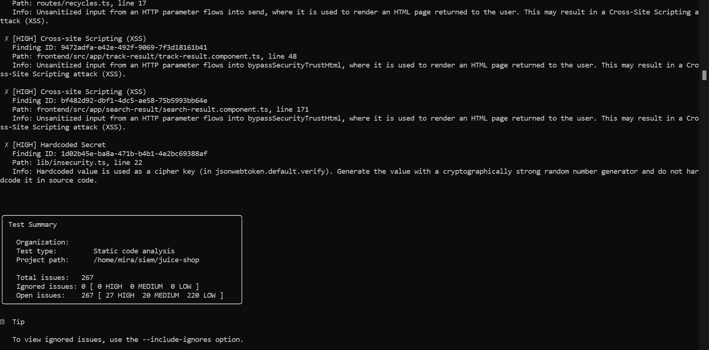
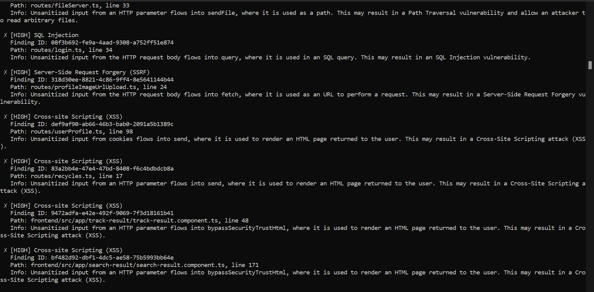
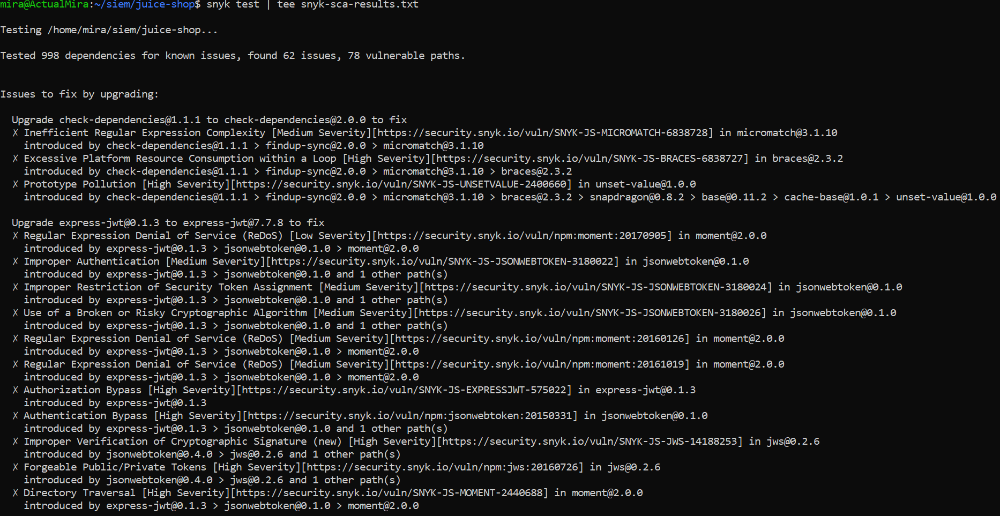
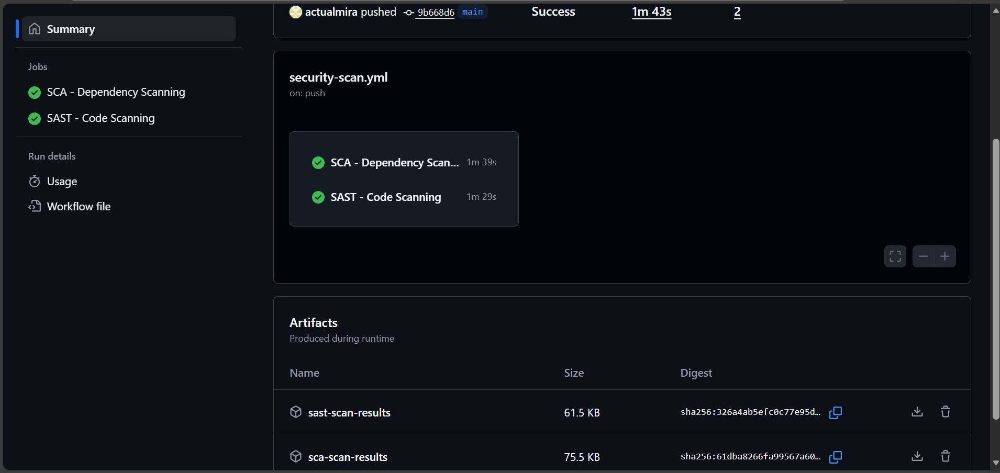
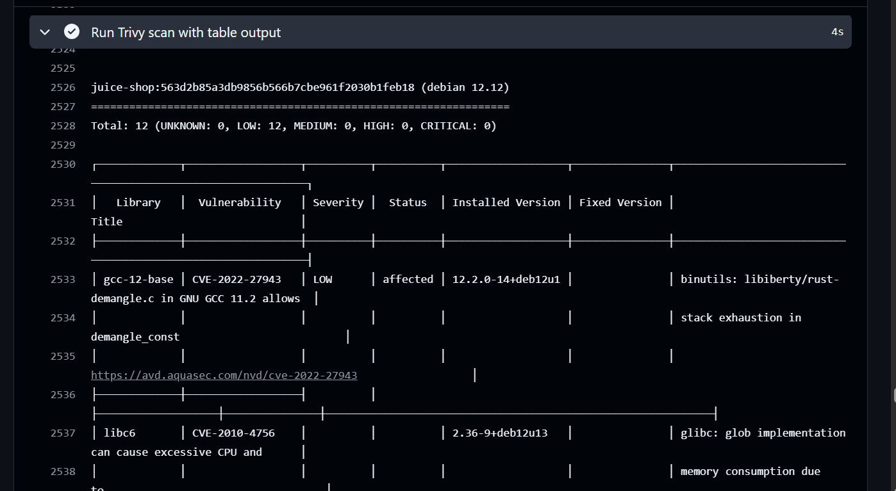
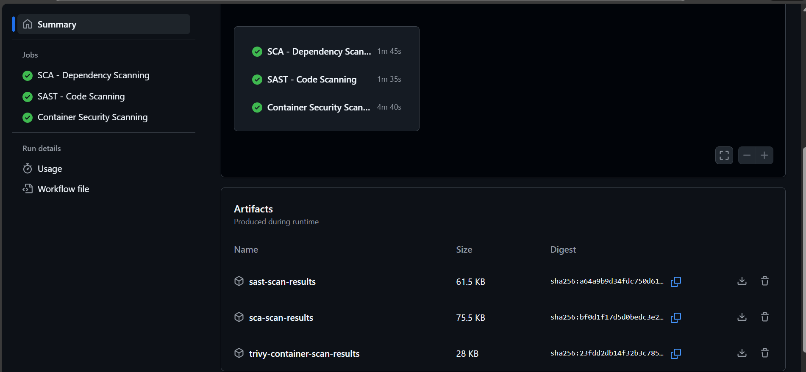
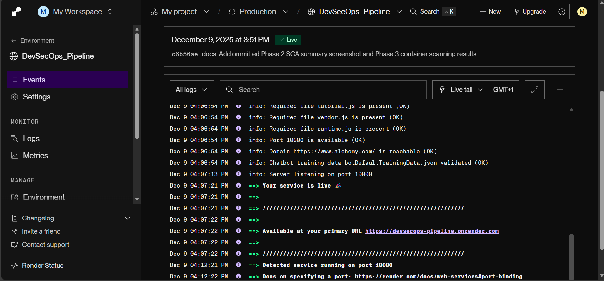
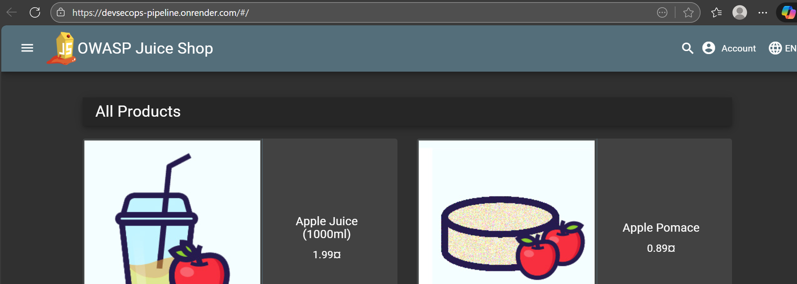
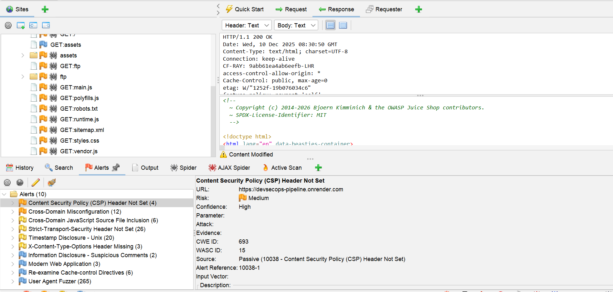

# DevSecOps Security Pipeline (Shift-Left Security)

A comprehensive DevSecOps implementation demonstrating automated security testing (SAST, SCA, Container) integrated into CI/CD pipelines, and DAST

This project uses [OWASP Juice Shop](https://owasp-juice.shop) as the target application for security testing. For complete attribution and project scope details, see [APPLICATION.md](APPLICATION.md).

---

## 📋 Table of Contents

- [Project Overview](#-project-overview)
- [Skills Demonstrated](#-skills-demonstrated)
- [Technical Stack](#-technical-stack)
- [Phase 1: Manual Security Testing](#phase-1-manual-security-testing)
- [Phase 2: Automated Local Scanning](#phase-2-automated-local-scanning)
- [Phase 3: CI/CD Security Pipeline](#phase-3-cicd-security-pipeline)
- [Phase 4: Deployment and DAST](#phase-4-deployment-and-dast)
- [Lessons and Conclusion](#-lessons_and_conclusion)

---

## Project Overview

This project demonstrates my DevSecOps skills, where I built a complete security automation pipeline. I worked with [OWASP Juice Shop](https://github.com/juice-shop/juice-shop), an intentionally vulnerable application, to demonstrate comprehensive security testing that identifies real world vulnerabilities at the early stage.

**Why This Project Matters**

Modern applications face constant security threats and detecting loop holes earlier minimizes potential damage. In this project, I  demonstrated how to integrate security into every stage of the development lifecycle; from code commit to production deployment. By implementing security-first practices throughout the workflow, We can **Detect vulnerabilities early**, **reduce risk exposure in production**, **maintain compliance with industry standards** and **enable faster and secure deployments**

---

## Skills Demonstrated

### Security Testing
- **Manual Exploitation**: Demonstrated understanding of vulnerability exploitation through hands-on testing
- **SAST (Static Application Security Testing)**: Automated source code scanning for security flaws before deployment
- **SCA (Software Composition Analysis)**: Automated vulnerable dependencies scanning before deployment
- **Container Security**: Integrated automated scanning for Docker images and OS packages vulnerabilities before deployment
- **DAST (Dynamic Application Security Testing)**: Deployed and Tested the application to identify dynamic vulnerabilities

### DevOps & CI/CD
- **GitHub Actions Workflows**: Built production-grade automated security testing 
- **Workflow Optimization**: Reduced unnecessary runs through strategic path filtering
- **Artifact Management**: Created audit trails for compliance and security review

### Security Engineering Mindset
- **Defense in Depth**: Implemented multiple security layers knowing no single approach is sufficient
- **Shift-Left Security**: Integrated security testing early in development to catch issues before production
---

## Technical Stack

### Application
| Component | Technology |
|-----------|-----------|
| **Application** | OWASP Juice Shop |
| **Framework** | Express.js (Node.js) |
| **Frontend** | Angular |
| **Language** | TypeScript, JavaScript |
| **Database** | SQLite |
| **Containerization** | Docker |

### Security Tools
| Layer | Tool | Purpose |
|-------|------|---------|
| **SAST** | Snyk Code | Source code vulnerability analysis |
| **SCA** | Snyk Open Source | Dependency vulnerability scanning |
| **Container** | Trivy | Docker image and OS package scanning |
| **DAST** | OWASP ZAP | Dynamic application security testing |

### CI/CD & Deployment
| Component | Technology |
|-----------|-----------|
| **CI/CD Platform** | GitHub Actions |
| **Cloud Hosting** | Render.com |
| **Runtime** | Node.js 18 (CI/CD), Node.js 20 (Container) |
| **Base Image** | node:20-alpine |

---

## Phase 1: Manual Security Testing

**Objective:** To understand some of the application's vulnerabilities through hands-on exploitation before implementing automated scanning.

### SQL Injection: Authentication Bypass

**OWASP Top 10 Classification:** A03:2021 – Injection

I manipulated the email input field with SQL injection payload to alter the database query logic, bypassing authentication without valid credentials.

```
Email: ' or 1=1--
Password: [33]
```

The application accepted this payload and logged me into Admin account successfully without requiring valid credentials, demonstrating a critical authentication bypass vulnerability.
project_screenshots/phase1/Screenshot 2025-11-26 130646.png


*Successful authentication bypass - gained admin access without valid credentials*

The root cause is **trusting user input without validation**. The application takes whatever the user types and directly inserts it into a SQL query. It treats user input as code.

The **secure approach** should be using parameterized queries where user input is never interpreted as SQL code:

```typescript
// SECURE CODE (parameterized query)
await models.sequelize.query(
  'SELECT * FROM Users WHERE email = ? AND password = ? AND deletedAt IS NULL',
  {
    replacements: [req.body.email, security.hash(req.body.password)],
    type: QueryTypes.SELECT,
    model: UserModel,
    plain: true
  }
)

// Or with Sequelize ORM:
await UserModel.findOne({
  where: {
    email: req.body.email,
    password: security.hash(req.body.password),
    deletedAt: null
  }
})
```

This works because the database interpretes `?` placeholders as data, not code. No matter what the user types, it's always treated as a string value, never as SQL syntax.

---

### Cross-Site Scripting (XSS): DOM-Based JavaScript Injection

**OWASP Top 10 Classification:** A03:2021 – Injection

I injected malicious JavaScript into the search input to demonstrate how arbitrary codes are executed in the browser. The application had client-side filtering but I crafted a payload that bypassed the initial defenses.

**The first attempt failed**: The application filtered this payload. When I submitted it, nothing happened. 

```html
<script>alert('mira xss')</script>
```


**I succeeded on the second attempt**: This worked and JavaScript was executed, displaying an alert box.
```html

```


Angular has built-in Content Security Policy (CSP) protection that blocks inline `<script>` tags by default. `` tag is a valid HTML element so CSP doesn't block it, src=x is invalid, image fails to load, **onerror event handler triggers** and **JavaScript in onerror is executed**

Although Angular also has built-in XSS protection that automatically sanitizes HTML, the developer explicitly **bypassed** this protection using `bypassSecurityTrustHtml()`, this is then rendered in the HTML template, which inserts the unsanitized HTML directly into the DOM, allowing my JavaScript to execute.

DOM-based XSS can be dangerous because server-side security measures can't see it thereby bypassing server-side input validation

### Phase 1 Findings

| Vulnerability | Severity | Impact | OWASP Top 10 |
|---------------|----------|--------|--------------|
| SQL Injection | Critical | Complete database compromise, authentication bypass | A03:2021 - Injection |
| DOM-Based XSS | High | Session hijacking, credential theft, account takeover | A03:2021 - Injection |


---

## Phase 2: Automated Local Scanning

**Objective:** To implement automated SAST and SCA scanning locally before integrating into CI/CD pipeline.

Running security scans locally before CI/CD pipeline integration is an industry best practice because developers can iterate quickly, fix issues, and test again without the overhead of pushing code and waiting for automated processes.

This approach is also cost-efficient because issues are caught before commit, resulting in fewer pipeline runs and lower compute costs. It follows the shift-left security principle of catching vulnerabilities as early as possible in the development process.

I used **Snyk** because:

- It is industry-leading platform and integrates SAST and SCA in a single tool, reducing tool sprawl and complexity
- It also has a developer-friendly interface with actionable remediation guidance and comprehensive vulnerability database covering both code and dependency vulnerabilities

### Setup, Authentication and Source Code Analysis (SAST)
```bash
# Install Snyk CLI globally
npm install -g snyk

# Authenticate with Snyk API Token
snyk auth

snyk code test --json > snyk-sast-results.json
```

The scan identified **267 issues** across the codebase, this demonstrates why automated scanning is important; it provides comprehensive coverage across the entire codebase in minutes, whereas manual testing can only realistically cover a fraction of the code. The combination of automated scanning for breadth and manual testing for deeper vulnerability understanding provides a balanced approach.


*Snyk Code scan summary showing 267 total issues*


*Detailed view of vulnerabilities including SQL injection in routes/login.ts - the same one I exploited manually*


SAST identified code-level vulnerability patterns, but it can't always verify whether a flagged vulnerability is actually exploitable in practice; it identifies the pattern but runtime context sometimes prevents exploitation. 

SAST can't detect issues that only manifest when the application runs, like missing security headers, broken session management or insecure business logic. Also, SAST can't analyze dependencies; that's where SCA comes in.

This is why security testing requires multiple approaches. SAST catches code-level issues but combining it with manual testing, dynamic testing, and dependency scanning provides comprehensive coverage that can't be achieved by one tool.

---

### SCA: Dependency Vulnerability Scanning

```bash
snyk test --json > snyk-sca-results.json
```

Modern applications depend heavily on third-party packages. Software Composition Analysis scans all dependencies against known vulnerability databases (CVEs and security advisories) to identify compromised or vulnerable packages in the dependency tree.

The scan analyzed **998 dependencies** and found **62 vulnerabilities**:



---

## Phase 3: CI/CD Security Pipeline

**Objective:** Automate security scanning in GitHub Actions to run on every code change, implementing true shift-left security.

Running scans locally are valuable but it has a limitation; it relies on human factor, and human error is inevitable. One might forget to scan before committing, especially under deadline pressure but with automated security scanning, it happens at every single push or pull, without exception.

### Initial Workflow Implementation

I created a [GitHub Actions workflow](.github/workflows/security-scan.yml) with two parallel jobs for SAST and SCA scanning. My goal was to make security testing as fast as possible while being thorough.

**Initial Workflow Structure:**
```yaml
name: Security Scanning

on:
  push:
    branches: [ main ]
  pull_request:
    branches: [ main ]
  workflow_dispatch:

jobs:
  sca-scan:
    name: SCA - Dependency Scanning
    runs-on: ubuntu-latest
    
    steps:
      - name: Checkout code
        uses: actions/checkout@v4
      
      - name: Setup Node.js
        uses: actions/setup-node@v4
        with:
          node-version: '18'
      
      - name: Install dependencies
        run: npm install --ignore-scripts
      
      - name: Install Snyk CLI
        run: npm install -g snyk
      
      - name: Run Snyk SCA scan
        continue-on-error: true
        run: snyk test --json | tee sca-results.json
        env:
          SNYK_TOKEN: ${{ secrets.SNYK_TOKEN }}
      
      - name: Upload SCA results artifact
        uses: actions/upload-artifact@v4
        with:
          name: sca-scan-results
          path: sca-results.json
```

I used the --ignore-scripts flag to prevent npm from executing postinstall or preinstall scripts during dependency scanning because malicious or compromised packages could contain scripts that can execute arbitrary code on the GitHub Actions runner and could for example steal the GITHUB_TOKEN or other secrets. Since the purpose of SCA is to analyze package metadata and known vulnerabilities and not to run the application, skipping scripts makes the scan faster and more reliable by avoiding script execution failures that are not relevant to vulnerability detection.

I configured **`continue-on-error: true`** because this is a demo project, in production, I'd set this to `false` for Critical/High severity vulnerabilities, which will automatically prevent deploying vulnerable code.

I used tee instead of simple file redirection because it creates file and console output simultaneously which provides real-time visibility during the workflow execution and also creates persistent artifacts for compliance and audit purposes.

I also implemented **Artifact Generation** so that all scan results are uploaded as artifacts, creating a comprehensive audit trail. If a vulnerability is found in production, I can trace back to see if the scans caught it and when.

The workflow needed my Snyk API token to authenticate. I stored this as a GitHub Secret (SNYK_TOKEN) instead of hardcoding it in the workflow file, which is a common security mistake that exposes credentials in version control. Another alternative could be using a dedicated secret management systems like AWS Secrets Manager, HashiCorp Vault, or Azure Key Vault with automatic rotation and granular access policies.



*Both SAST and SCA jobs completed successfully and artifacts generated*

The **initial workflow** executed successfully but it ran on **every push to main**, regardless of what changed (documents, codes) which is inefficient and wasteful.

### Path Filtering for Optimization

I implemented a comprehensive path filtering to trigger scans **only when application code changes**:
```yaml
on:
  push:
    branches: [ main ]
    paths:
      # JavaScript and TypeScript
      - '**.js'
      - '**.ts'
      - '**.jsx'
      - '**.tsx'
      # Frontend templates and styles
      - '**.html'
      - '**.scss'
      - '**.sass'
      - '**.css'
      - '**.pug'
      # Smart contracts
      - '**.sol'
      # Dependencies
      - 'package.json'
      - 'package-lock.json'
      # Source directories
      - 'routes/**'
      - 'models/**'
      - 'lib/**'
      - 'frontend/**'
      - 'data/**'
      # Configuration files
      - 'Dockerfile'
      - '.dockerignore'
      - 'server.ts'
      - 'tsconfig.json'
```

With this path filtering, the workflow will not run when I update documentation, screenshots, or README files which reduces unnecessary CI/CD runs by approximately 75-80%. I used wildcards to match files in any directory for comprehensive code coverage, and explicit directory patterns (routes/**) to specify critical source directories.

---

### Adding Container Security Scanning

Even if my application code and dependencies are completely secure, the Docker container could have vulnerabilities like base image vulnerabilities, OS package vulnerabilities, or container configuration issues. 

Many modern applications run in containers and container security is just as critical as application security. So, I integrated **Trivy** Container Scanning into the pipeline.

I added a third job using Trivy, an industry-standard open-source container scanner:
```yaml
container-scan:
    name: Container Security Scanning
    runs-on: ubuntu-latest
    
    steps:
      - name: Checkout code
        uses: actions/checkout@v4
      
      - name: Build Docker image
        run: docker build -t juice-shop:${{ github.sha }} .
      
      - name: Run Trivy vulnerability scanner
        uses: aquasecurity/trivy-action@master
        with:
          image-ref: juice-shop:${{ github.sha }}
          format: 'json'
          output: 'trivy-results.json'
      - name: Run Trivy scan with table output
        uses: aquasecurity/trivy-action@master
        with:
          image-ref: juice-shop:${{ github.sha }}
          format: 'table'
      
      - name: Upload Trivy scan results
        uses: actions/upload-artifact@v4
        with:
          name: trivy-container-scan-results
          path: trivy-results.json

```
I configured the three scan jobs to run in parallel without dependencies because I wanted maximum visibility into the security posture across all layers. In a production environment, I'd configure the container job to be dependent on the sast and sca jobs in order to prevent wasting resources scanning containers built from vulnerable code.

I tag each Docker image with the Git commit SHA: `${{ github.sha }}`, this ensures that each commit builds a uniquely tagged image and scan results can be traced to specific code versions

I configured Trivy to run twice with different output formats because they serve different purposes. The JSON output provides machine readable artifacts for audit trails and can also be integrated into vulnerability management platforms if needed. The table output provides immediate visual feedback in the GitHub Actions logs, so that developers can be able to triage issues quickly without downloading artifacts.

**Trivy Scan Results:**


*Trivy scan showing 12 LOW severity vulnerabilities in base image*

The scan found **12 LOW severity vulnerabilities**, all in the base image's Debian packages:

**In a production environment**, I would: regularly update the base image for security patching, evaluate if the findings are within acceptable risk threshold, and set CI/CD to fail on CRITICAL/HIGH findings.

The **complete workflow** provides comprehensive security coverage across all layers:




### Phase 3 Summary

In this phase, I implemented a production-grade CI/CD security pipeline that:

- Runs automatically on every code change and only on code changes; 75-80% reduction in unnecessary runs
- Scans code, dependencies, and containers in parallel and uses industry-standard tools and practices
- Provides immediate feedback to developers
- Generates artifacts for audit trail 

In a **production environment**, I could also add:

1. Policy as Code to define acceptable vulnerability thresholds that automatically fail builds when exceeded

2. Use DefectDojo or OWASP Dependency-Track for centralized vulnerability management and trend analysis

3. Implement GitGuardian or TruffleHog to detect accidentally committed secrets

4. Scan dependencies for problematic licenses (GPL in commercial products, etc.)

5. Automatically comment scan results directly on pull requests for developer visibility

---

## Phase 4: Deployment and DAST

**Objective:** Deploy the application to a cloud environment and perform Dynamic Application Security Testing (DAST) to identify runtime vulnerabilities that pre-deployment testing cannot detect, such as runtime configuration issues, deployment-specific misconfigurations, missing HTTP security headers, and CORS policies in practice.

I Signed up for **Render** using my GitHub account, authorized Render to access my repository, configured the service, and enabled automatic deployments on push
 


*Render dashboard showing successful deployment*

**Application URL:** `https://devsecops-pipeline.onrender.com`


*OWASP Juice Shop running on Render*

I used **OWASP ZAP** for DAST


*ZAP alerts grouped by severity*


**The scan found 10 alerts** including **Content Security Policy (CSP) Header Not Set** (a runtime configuration issue SAST couldn't detect) and Cross-Domain Misconfiguration. These shows that **SAST and DAST are complementary** (SAST found code vulnerabilities and DAST found deployment issues)

In a production environment, regular penetration testing with Burp Suite for example can provide a deeper insight on exploitable vulnerabilities. Runtime Application Security Protection (RASP) can also be implemented for ongoing monitoring

## Lessons and Conclusion

This project demonstrates security automation across four phases: manual exploitation to understand vulnerabilities, local scanning for fast iteration, CI/CD integration for consistent enforcement, and deployment with runtime testing. The automated pipeline reduced unnecessary runs by 75-80% while scanning code, dependencies, and containers on every commit.

**Key Takeaway:** Effective security requires defense in-depth approaches. SAST caught code patterns, SCA found vulnerable dependencies, container scanning detected base image issues, and DAST revealed runtime misconfigurations. Each tool found issues the others missed, proving the importance of layered defenses.


